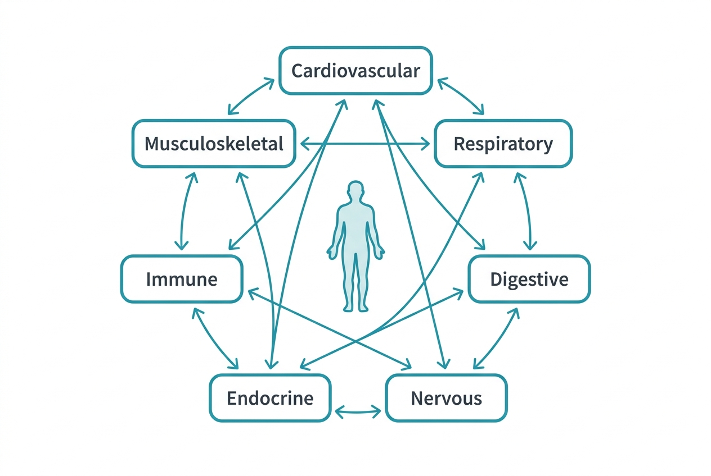

Your body is not a collection of independent parts. It is an integrated system of systems, each one dependent on the others, communicating through chemical signals, electrical impulses, and shared resources.

When you eat a meal, your digestive system breaks it down, your cardiovascular system distributes the nutrients, your endocrine system manages the hormonal response to incoming glucose, and your nervous system coordinates the whole process without you thinking about it. No single system works alone.

## What this section covers

Over the next seven articles, we will walk through each of the body's major systems — cardiovascular, respiratory, digestive, nervous, endocrine, immune, and musculoskeletal. The goal is not to memorize anatomy. It is to build a mental map of what each system does, what it needs, and how it talks to the others.

Think of this section as installing the operating system. Later sections on hormones, nutrition, sleep, and lifestyle will be the applications that run on top of it. Without understanding the underlying systems, the rest of the course would be a list of disconnected facts.

## How to read this course

Each article is designed to be read in about five minutes. They follow a deliberate order — each article builds on concepts introduced earlier. You can skip around using the table of contents, but reading sequentially will give you the clearest picture.

## Sources

- [OpenStax Anatomy and Physiology – An Introduction to the Human Body](https://openstax.org/books/anatomy-and-physiology-2e/pages/1-introduction)
- [NIH – What Is Systems Biology?](https://irp.nih.gov/catalyst/v19i6/systems-biology-as-defined-by-nih)
