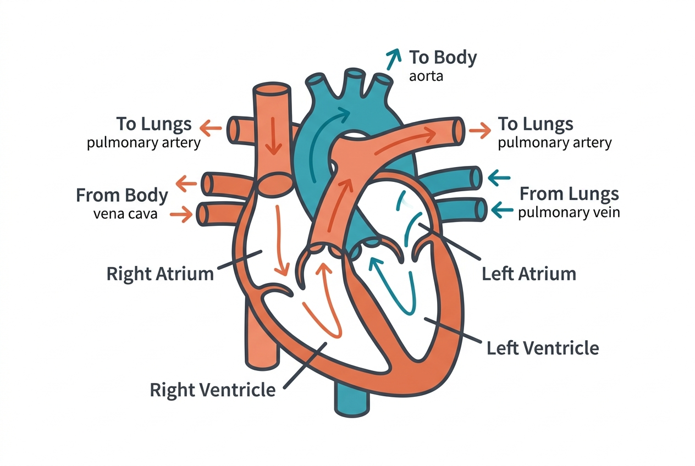

Your cardiovascular system is the body's delivery network. It moves oxygen, nutrients, hormones, and immune cells to every tissue, and carries away carbon dioxide and other waste products. Without it, no other system can function — cells begin to die within minutes of losing blood supply.

## The heart as a pump

The human heart is a muscular organ roughly the size of a closed fist, located slightly left of center in the chest. It beats approximately 100,000 times per day, pumping about 7,500 liters of blood through the body in that time.

The heart has four chambers. The right atrium receives oxygen-depleted blood from the body via the superior and inferior vena cava. It passes into the right ventricle, which pumps it to the lungs through the pulmonary arteries. In the lungs, blood picks up oxygen and releases carbon dioxide. Oxygen-rich blood returns to the left atrium via the pulmonary veins, moves into the left ventricle, and is pumped out through the aorta to the rest of the body.

The left ventricle does the heaviest work — its walls are roughly three times thicker than those of the right ventricle because it must generate enough pressure to push blood through the entire systemic circulation.

## Blood vessels: arteries, capillaries, and veins

The vascular network has three main types of vessels:

- **Arteries** carry oxygenated blood away from the heart. They have thick, muscular walls to handle high pressure. The largest, the aorta, is about 2.5 centimeters in diameter.
- **Capillaries** are microscopic vessels where the actual exchange happens. Their walls are just one cell thick, allowing oxygen, nutrients, and waste to pass between blood and tissues. Laid end to end, the body's capillaries would stretch roughly 100,000 kilometers.
- **Veins** return deoxygenated blood to the heart. They operate at lower pressure and contain one-way valves that prevent blood from flowing backward, especially important in the legs where blood must travel upward against gravity.

## What blood carries

Blood itself is a complex tissue. About 55% is plasma — a yellowish fluid made mostly of water, carrying dissolved proteins, glucose, hormones, and electrolytes. The remaining 45% is primarily red blood cells (erythrocytes), which contain hemoglobin, the iron-rich protein that binds oxygen.

Blood also carries white blood cells (leukocytes) for immune defense and platelets (thrombocytes) for clotting. Every liter of blood contains roughly 5 billion red blood cells, 7 million white blood cells, and 250 million platelets.

## Blood pressure and regulation

Blood pressure is the force that blood exerts on vessel walls. It is expressed as two numbers: systolic pressure (when the heart contracts) over diastolic pressure (when it relaxes). A typical healthy reading is around 120/80 mmHg.

The body regulates blood pressure through several mechanisms. The autonomic nervous system can constrict or dilate blood vessels within seconds. The kidneys adjust blood volume over hours by retaining or excreting water and sodium. Hormones like aldosterone, antidiuretic hormone (ADH), and the renin-angiotensin system provide additional longer-term control.

## How it connects to other systems

The cardiovascular system is deeply intertwined with every other system covered in this course:

- The **respiratory system** loads blood with oxygen and removes carbon dioxide at the lungs.
- The **digestive system** delivers absorbed nutrients into the bloodstream via the hepatic portal system.
- The **endocrine system** uses the blood as its postal service — hormones travel through the bloodstream to reach target cells.
- The **immune system** relies on the bloodstream to deploy white blood cells to sites of infection.
- The **nervous system** controls heart rate and blood vessel diameter through the autonomic nervous system.

Understanding this system first gives you the map that every later topic will reference.

## Sources

- [NHLBI – How the Heart Works](https://www.nhlbi.nih.gov/health/heart/how-heart-works)
- [NHLBI – Blood Pressure](https://www.nhlbi.nih.gov/health/high-blood-pressure/causes)
- [OpenStax Anatomy and Physiology – The Cardiovascular System: The Heart](https://openstax.org/books/anatomy-and-physiology-2e/pages/19-1-heart-anatomy)
- [MedlinePlus – Blood](https://medlineplus.gov/blood.html)
