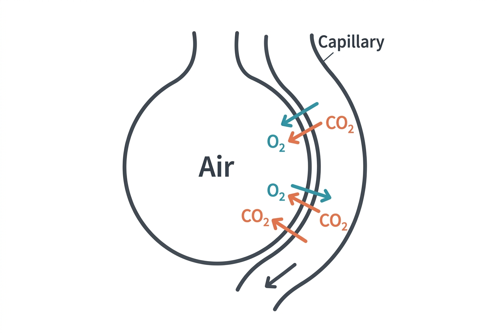

Every cell in your body needs oxygen to convert nutrients into usable energy. The respiratory system handles the supply side of that equation — pulling oxygen from the air and delivering it to the blood, while simultaneously removing carbon dioxide, a metabolic waste product that would become toxic if it accumulated.

## The path air takes

When you breathe in, air enters through the nose or mouth and passes through the pharynx and larynx into the trachea (windpipe). The trachea splits into two bronchi, one for each lung. These bronchi subdivide repeatedly into smaller and smaller bronchioles, like branches of an inverted tree, eventually ending in clusters of tiny air sacs called alveoli.

The human lungs contain approximately 480 million alveoli. Each alveolus is surrounded by a dense network of capillaries. The walls of the alveoli are incredibly thin — about 0.2 micrometers — which allows gases to diffuse rapidly between air and blood.

## Gas exchange

Oxygen moves from the air in the alveoli into the blood by simple diffusion — it travels from an area of high concentration (the alveolus) to low concentration (the capillary blood). Carbon dioxide moves in the opposite direction, from blood into the alveolus, to be exhaled.

This process happens passively, driven entirely by concentration gradients. No active pumping is required for the gas exchange itself, though the mechanical act of breathing — moving air in and out — is an active process controlled by muscles.

## The mechanics of breathing

Breathing is driven primarily by the diaphragm, a dome-shaped muscle beneath the lungs. When the diaphragm contracts, it flattens and moves downward, expanding the chest cavity. This creates negative pressure in the lungs, pulling air in (inhalation). When the diaphragm relaxes, it returns to its dome shape, pushing air out (exhalation).

The intercostal muscles between the ribs assist by expanding and contracting the rib cage. At rest, a healthy adult breathes about 12 to 20 times per minute, moving roughly 6 to 8 liters of air. During vigorous exercise, that can increase to 100 liters per minute or more.

## How breathing is regulated

You do not have to think about breathing — the brainstem handles it automatically. The medulla oblongata and pons contain respiratory centers that set the basic rhythm. These centers respond primarily to carbon dioxide levels in the blood, not oxygen levels.

When carbon dioxide rises (for example, during exercise), chemoreceptors in the brainstem and carotid arteries signal the respiratory centers to increase breathing rate and depth. This is why you breathe harder during physical activity — your muscles are producing more carbon dioxide, and the body needs to expel it faster.

You can override this automatic control temporarily — holding your breath, for instance — but the brainstem will eventually force a breath when carbon dioxide levels get too high.

## Oxygen transport in the blood

Once oxygen crosses the alveolar membrane into the blood, about 98.5% of it binds to hemoglobin inside red blood cells. Each hemoglobin molecule can carry four oxygen molecules. The remaining 1.5% dissolves directly in the plasma.

When oxygenated blood reaches tissues with high metabolic activity (exercising muscles, for example), the local environment — higher carbon dioxide, lower pH, higher temperature — causes hemoglobin to release its oxygen more readily. This elegant mechanism ensures that oxygen goes preferentially to the tissues that need it most.

## Connections to other systems

- The **cardiovascular system** is the respiratory system's essential partner — it carries the gases that the lungs exchange.
- The **nervous system** controls breathing rate and rhythm through the brainstem.
- The **musculoskeletal system** provides the diaphragm and intercostal muscles that physically move air.
- During the **immune response**, the respiratory tract's mucous membranes and cilia serve as a first line of defense against inhaled pathogens.

## Sources

- [NHLBI – How the Lungs Work](https://www.nhlbi.nih.gov/health/lungs/how-lungs-work)
- [OpenStax Anatomy and Physiology – The Respiratory System](https://openstax.org/books/anatomy-and-physiology-2e/pages/22-1-organs-and-structures-of-the-respiratory-system)
- [MedlinePlus – Breathing](https://medlineplus.gov/breathing.html)
