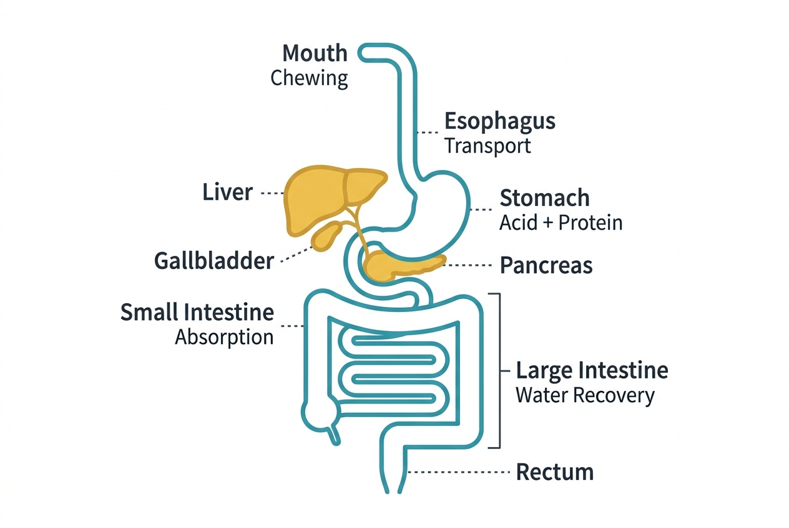

Food, as you eat it, is useless to your cells. A piece of bread, a bite of chicken, a handful of almonds — none of these can cross a cell membrane or enter the bloodstream in their original form. The digestive system exists to disassemble food into its molecular components: glucose, amino acids, fatty acids, vitamins, and minerals that cells can actually absorb and use.

## The alimentary canal

The digestive tract is essentially a long tube running from mouth to anus, roughly 9 meters (30 feet) in total length. Each section performs a specific role:

- **Mouth:** Mechanical digestion begins with chewing, which breaks food into smaller pieces. Salivary amylase, an enzyme in saliva, starts breaking down starches into simpler sugars.
- **Esophagus:** A muscular tube about 25 centimeters long that moves food from the mouth to the stomach via rhythmic contractions called peristalsis.
- **Stomach:** A muscular, acidic chamber where proteins begin to break down. Gastric acid (hydrochloric acid) has a pH of 1.5 to 3.5, strong enough to denature proteins. The enzyme pepsin, activated by this acid, cleaves proteins into smaller peptides. The stomach also mechanically churns food into a semi-liquid called chyme.
- **Small intestine:** The primary site of digestion and absorption. At about 6 meters long with extensive folds and finger-like projections (villi), it has an enormous surface area — roughly 32 square meters, about the size of a studio apartment. Here, enzymes from the pancreas and bile from the liver complete the breakdown of carbohydrates, proteins, and fats. Nutrients are absorbed through the intestinal wall into the bloodstream.
- **Large intestine (colon):** Absorbs water and electrolytes from the remaining indigestible material. It also houses the majority of the gut microbiome — trillions of bacteria that ferment certain fibers and produce vitamins like vitamin K and some B vitamins.
- **Rectum and anus:** Store and expel waste.

## Accessory organs

Several organs outside the alimentary canal contribute essential digestive substances:

- **Liver:** Produces bile, which emulsifies fats — breaking large fat droplets into smaller ones so that lipase enzymes can work on them more effectively. The liver also processes absorbed nutrients, detoxifies harmful substances, and stores glycogen.
- **Gallbladder:** Stores and concentrates bile, releasing it into the small intestine when fat is present.
- **Pancreas:** Secretes a cocktail of digestive enzymes (lipase for fats, proteases for proteins, amylase for carbohydrates) into the small intestine. It also releases bicarbonate to neutralize the acidic chyme coming from the stomach.

## How absorption works

In the small intestine, nutrients cross the intestinal lining through several mechanisms. Simple sugars and amino acids are absorbed through active transport — a process that requires energy. Fatty acids and fat-soluble vitamins are absorbed through the lymphatic system before reaching the bloodstream. Water-soluble vitamins and minerals are absorbed through various transporter proteins.

Absorbed nutrients enter the blood and travel via the hepatic portal vein to the liver, which serves as a processing center — regulating what enters general circulation.

## Digestive timing

From the moment you swallow, it takes roughly 6 to 8 hours for food to pass through the stomach and small intestine, and another 36 hours or so to move through the colon. The total transit time varies significantly between individuals, ranging from about 24 to 72 hours depending on factors like fiber intake, hydration, and physical activity.

## Connections to other systems

- The **cardiovascular system** carries absorbed nutrients from the intestines to the liver and then to every cell.
- The **nervous system** controls digestive motility and secretion through the enteric nervous system — sometimes called the "second brain" — which contains about 500 million neurons.
- The **endocrine system** regulates digestion through hormones like gastrin, secretin, and cholecystokinin, and the digestive system itself produces hormones that affect appetite (ghrelin, for example, is produced in the stomach).
- The **immune system** maintains a heavy presence in the gut — roughly 70% of the body's immune tissue is associated with the digestive tract.

## Sources

- [NIDDK – Your Digestive System and How It Works](https://www.niddk.nih.gov/health-information/digestive-diseases/digestive-system-how-it-works)
- [OpenStax Anatomy and Physiology – The Digestive System](https://openstax.org/books/anatomy-and-physiology-2e/pages/23-1-overview-of-the-digestive-system)
- [Cleveland Clinic – Digestive System](https://my.clevelandclinic.org/health/body/7041-digestive-system)
- [MedlinePlus – Digestive System](https://medlineplus.gov/digestivesystem.html)
