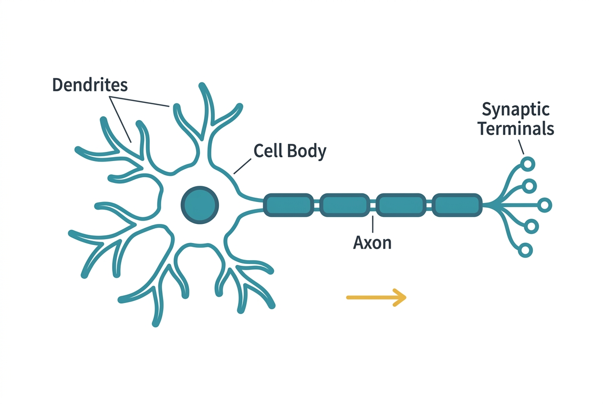
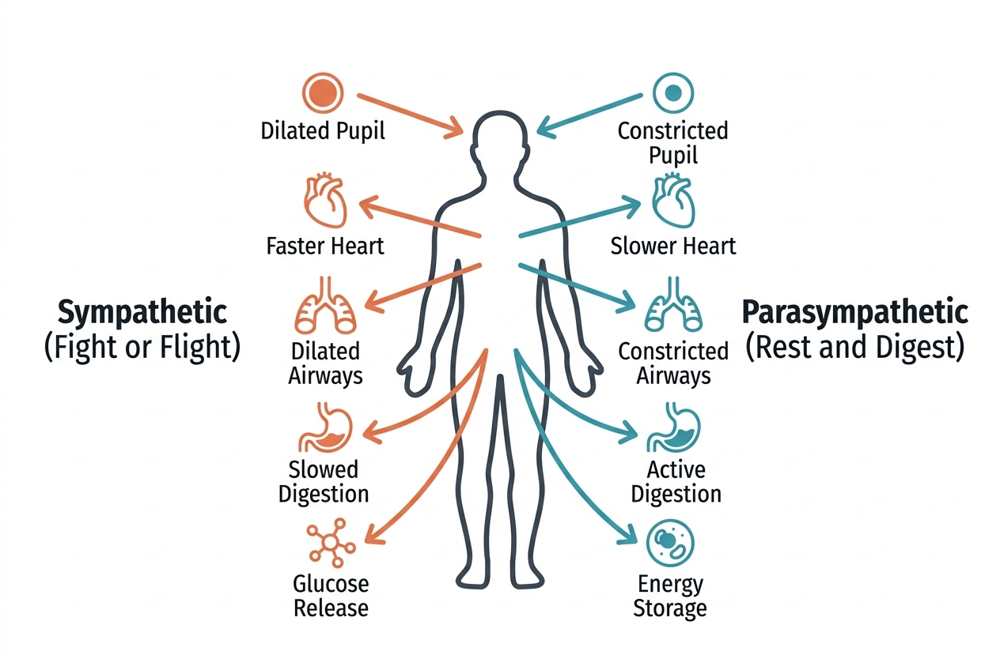

If the cardiovascular system is the body's delivery network and the endocrine system is its postal service, the nervous system is its electrical wiring. It detects changes in the environment, processes information, and coordinates responses — often within milliseconds.

## Two major divisions

The nervous system is divided into two structural components:

- **Central nervous system (CNS):** The brain and spinal cord. This is the command center where information is integrated and decisions are made.
- **Peripheral nervous system (PNS):** All the nerves that branch out from the brain and spinal cord to the rest of the body. It carries sensory information inward and motor commands outward.

The peripheral nervous system is further divided functionally:

- **Somatic nervous system:** Controls voluntary movements — things you consciously decide to do, like picking up a glass or walking.
- **Autonomic nervous system (ANS):** Controls involuntary functions — heart rate, digestion, breathing, pupil dilation, and glandular secretion. You will encounter the ANS repeatedly throughout this course because it is deeply involved in stress responses, sleep regulation, and hormonal control.

## How neurons work

The basic functional unit of the nervous system is the neuron. The human brain contains roughly 86 billion neurons. Each neuron has three main parts:

- **Dendrites:** Branch-like extensions that receive signals from other neurons.
- **Cell body (soma):** Contains the nucleus and processes incoming signals.
- **Axon:** A long projection that transmits electrical signals away from the cell body to other neurons, muscles, or glands.

Neurons communicate through a combination of electrical and chemical signals. Within a neuron, signals travel as electrical impulses called action potentials, moving along the axon at speeds ranging from about 1 to 120 meters per second. At the junction between two neurons (the synapse), the electrical signal triggers the release of chemical messengers called neurotransmitters.

## Neurotransmitters

Neurotransmitters cross the tiny synaptic gap and bind to receptors on the next neuron, either exciting it (making it more likely to fire) or inhibiting it (making it less likely to fire). Key neurotransmitters include:

- **Acetylcholine:** Involved in muscle contraction and memory.
- **Dopamine:** Plays roles in motivation, reward, and movement.
- **Serotonin:** Influences mood, appetite, and sleep.
- **GABA (gamma-aminobutyric acid):** The primary inhibitory neurotransmitter, calming neural activity.
- **Norepinephrine:** Involved in alertness and the stress response.

The balance of these neurotransmitters shapes everything from your mood to your motor control.

## The autonomic nervous system in detail

The autonomic nervous system has two opposing branches:

- **Sympathetic nervous system:** Often called the "fight-or-flight" system. It accelerates heart rate, dilates airways, diverts blood to muscles, releases glucose from energy stores, and suppresses non-urgent functions like digestion. It prepares the body for action.
- **Parasympathetic nervous system:** Often called the "rest-and-digest" system. It slows heart rate, stimulates digestion, promotes energy storage, and supports maintenance functions. It returns the body to baseline after a stress response.

These two branches are not simply on-or-off switches. They are constantly active in varying degrees, creating a dynamic balance. The interplay between sympathetic and parasympathetic activity is central to understanding stress, sleep, and hormonal regulation — topics covered in later sections.

## The brain: a brief map

Rather than a comprehensive neuroanatomy lesson, here are the regions most relevant to the topics in this course:

- **Hypothalamus:** A small region at the base of the brain that serves as the primary link between the nervous and endocrine systems. It regulates body temperature, hunger, thirst, sleep, and hormonal output by controlling the pituitary gland.
- **Brainstem:** Controls automatic functions like breathing, heart rate, and blood pressure.
- **Prefrontal cortex:** Involved in planning, decision-making, and impulse control.
- **Amygdala:** Processes fear and emotional responses, playing a central role in stress reactions.

## Connections to other systems

- The **endocrine system** is tightly coupled to the nervous system through the hypothalamus-pituitary axis — a connection so important it gets its own discussion in the hormones section.
- The **cardiovascular system** depends on the autonomic nervous system to regulate heart rate and blood vessel tone moment to moment.
- The **digestive system** is controlled in part by the enteric nervous system, a semi-independent network of 500 million neurons embedded in the gut wall.
- The **immune system** interacts with the nervous system through inflammatory signals and the vagus nerve, which carries information between the brain and the gut.

## Sources

- [NINDS – Brain Basics: Know Your Brain](https://www.ninds.nih.gov/health-information/public-education/brain-basics/brain-basics-know-your-brain)
- [OpenStax Anatomy and Physiology – The Nervous System](https://openstax.org/books/anatomy-and-physiology-2e/pages/12-1-basic-structure-and-function-of-the-nervous-system)
- [MedlinePlus – Autonomic Nervous System](https://medlineplus.gov/autonomicnervoussystemdisorders.html)
- [Cleveland Clinic – Nervous System](https://my.clevelandclinic.org/health/body/21202-nervous-system)
