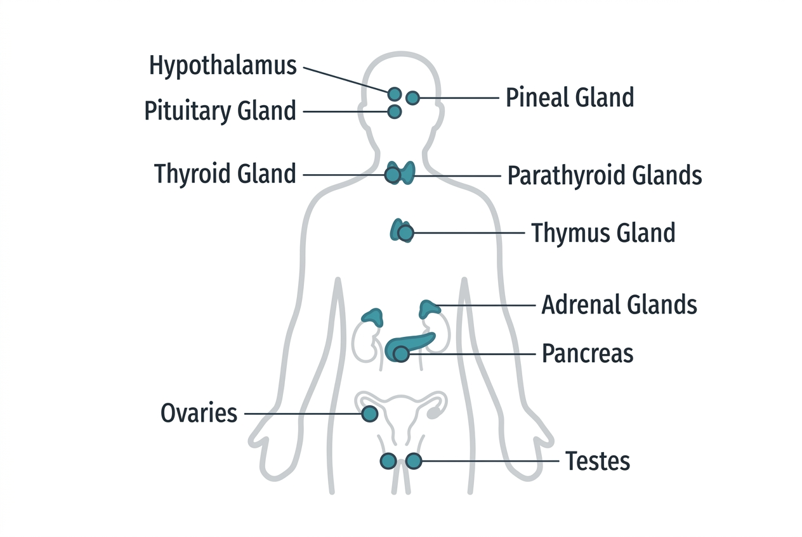

While the nervous system communicates through fast electrical signals, the endocrine system uses a slower but broader approach: it releases chemical messengers called hormones into the bloodstream. These hormones travel throughout the body and act on specific target cells that have the right receptors — like a broadcast signal that only certain radios can pick up.

## Speed versus reach

The nervous system operates in milliseconds but targets specific cells through direct wiring. The endocrine system operates over seconds to hours but can affect every cell in the body simultaneously. Both systems are essential, and they frequently work together — the hypothalamus in the brain serves as the primary bridge between them.

## Major endocrine glands

The endocrine system consists of several glands and hormone-producing tissues spread across the body:

- **Hypothalamus:** Sits at the base of the brain and acts as the master regulator. It produces releasing and inhibiting hormones that control the pituitary gland. It also monitors blood chemistry, body temperature, and signals from the nervous system.
- **Pituitary gland:** Often called the "master gland," it sits just below the hypothalamus. Its anterior lobe produces hormones that regulate growth (growth hormone), thyroid function (TSH), adrenal function (ACTH), reproduction (FSH, LH), and lactation (prolactin). Its posterior lobe stores and releases oxytocin and antidiuretic hormone (ADH), which are actually produced by the hypothalamus.
- **Thyroid gland:** Located in the neck, it produces T3 and T4, which regulate metabolic rate in nearly every cell. It also produces calcitonin, which helps regulate calcium levels.
- **Parathyroid glands:** Four small glands behind the thyroid that produce parathyroid hormone (PTH), raising blood calcium levels when they drop too low.
- **Adrenal glands:** Sit atop each kidney. The outer cortex produces cortisol (stress response), aldosterone (blood pressure regulation), and small amounts of androgens. The inner medulla produces epinephrine (adrenaline) and norepinephrine for rapid stress responses.
- **Pancreas:** Has both endocrine and digestive functions. Its islets of Langerhans contain beta cells (producing insulin) and alpha cells (producing glucagon), which together regulate blood glucose.
- **Gonads:** Ovaries produce estrogen and progesterone; testes produce testosterone. These regulate reproductive function but also affect bone density, muscle mass, mood, and cardiovascular health.
- **Pineal gland:** Produces melatonin, which regulates the sleep-wake cycle (circadian rhythm).

## How hormones work

Hormones are typically classified by their chemical structure:

- **Steroid hormones** (cortisol, estrogen, testosterone) are derived from cholesterol. They can pass through cell membranes and bind to intracellular receptors, directly influencing gene expression. Their effects tend to be slower but longer-lasting.
- **Peptide/protein hormones** (insulin, growth hormone) cannot cross the cell membrane. They bind to receptors on the cell surface and trigger signaling cascades inside the cell. Their effects can be rapid.
- **Amine hormones** (thyroid hormones, epinephrine) are derived from amino acids. Thyroid hormones behave more like steroids (slow, gene-level effects), while epinephrine acts fast like peptide hormones.

The concentration of hormones in the blood is typically very small — measured in nanograms or picograms per milliliter — yet their effects are profound because of the amplification that occurs through intracellular signaling pathways.

## Feedback loops

The endocrine system relies heavily on feedback mechanisms to maintain hormone levels within narrow ranges. The most common is **negative feedback**: when a hormone's effect reaches a certain level, it signals the gland to reduce production.

For example, when thyroid hormone levels rise in the blood, the hypothalamus and pituitary detect this and reduce their output of TRH and TSH, which in turn tells the thyroid to slow down. When thyroid levels drop, the cycle reverses. This keeps thyroid hormone within a functional range.

**Positive feedback** is rarer but important in specific situations, such as during childbirth (oxytocin) or the hormonal surge that triggers ovulation (LH surge). We will explore feedback loops in depth in the hormones section.

## The hypothalamic-pituitary axis

The most important structural feature of the endocrine system is the connection between the hypothalamus and pituitary gland. This axis controls:

- **HPA axis** (hypothalamic-pituitary-adrenal): Governs the stress response via cortisol.
- **HPT axis** (hypothalamic-pituitary-thyroid): Governs metabolic rate.
- **HPG axis** (hypothalamic-pituitary-gonadal): Governs reproductive hormones.

Understanding these axes is essential because disruptions in any of them affect multiple body systems simultaneously.

## Connections to other systems

- The **nervous system** directly controls the endocrine system through the hypothalamus — stress, sleep, light exposure, and temperature all feed into hormone regulation.
- The **cardiovascular system** distributes hormones to their target tissues.
- The **digestive system** both produces hormones (like ghrelin and GLP-1) and is regulated by them (insulin manages glucose from digestion).
- The **immune system** is modulated by cortisol and other hormones — chronic cortisol elevation suppresses immune function.

## Sources

- [NIH – Endocrine System Overview](https://training.seer.cancer.gov/anatomy/endocrine/)
- [OpenStax Anatomy and Physiology – The Endocrine System](https://openstax.org/books/anatomy-and-physiology-2e/pages/17-1-an-overview-of-the-endocrine-system)
- [Cleveland Clinic – Endocrine System](https://my.clevelandclinic.org/health/body/21201-endocrine-system)
- [MedlinePlus – Hormones](https://medlineplus.gov/hormones.html)
