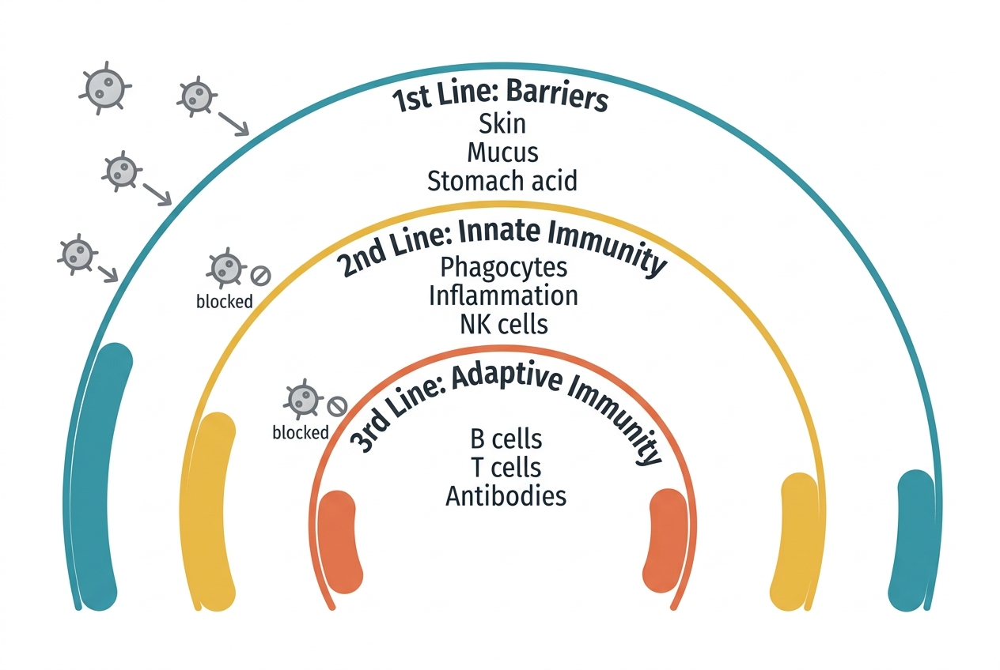

You are constantly surrounded by organisms that would thrive inside your body if given the chance — bacteria, viruses, fungi, and parasites. The immune system is a multi-layered defense network that identifies, contains, and eliminates these threats while distinguishing them from the body's own healthy cells.

## Three lines of defense

Immunologists traditionally describe the immune system in three layers:

### First line: physical and chemical barriers

Before any immune cell gets involved, the body has passive defenses that prevent most pathogens from ever getting in:

- **Skin:** A physical barrier of tightly packed cells. The outer layer (epidermis) is essentially waterproof and inhospitable to most microorganisms. Sweat and skin oils contain antimicrobial compounds.
- **Mucous membranes:** Line the respiratory, digestive, and urogenital tracts. Mucus traps pathogens. In the airways, tiny hair-like structures called cilia sweep mucus (and trapped microbes) upward toward the throat, where it is swallowed and destroyed by stomach acid.
- **Stomach acid:** With a pH as low as 1.5, gastric acid kills most ingested bacteria.
- **Tears and saliva:** Contain lysozyme, an enzyme that breaks down bacterial cell walls.

### Second line: innate immunity

If a pathogen gets past the barriers, the innate immune system provides a rapid, nonspecific response. It does not target specific pathogens — it responds the same way to any invader.

Key components include:

- **Phagocytes:** White blood cells like neutrophils and macrophages that engulf and digest pathogens. Neutrophils are the most abundant white blood cell and are usually the first to arrive at an infection site.
- **Natural killer (NK) cells:** Specialized lymphocytes that destroy virus-infected cells and some tumor cells by triggering them to self-destruct.
- **Inflammation:** When tissue is damaged or infected, local cells release chemical signals (histamines, prostaglandins) that increase blood flow to the area, making capillaries more permeable so that immune cells can reach the site. The classic signs — redness, heat, swelling, pain — are all products of this inflammatory response.
- **Fever:** Elevated body temperature can inhibit the growth of some pathogens and enhance certain immune responses. It is triggered by pyrogens — substances released by immune cells or by the pathogens themselves.
- **Complement system:** A group of about 30 proteins in the blood that, when activated, can directly destroy pathogens, mark them for destruction (opsonization), or trigger inflammation.

### Third line: adaptive immunity

The adaptive immune system is slower to respond initially — it takes days to mount a first-time response — but it is highly specific and creates immunological memory, allowing a faster, stronger response upon re-exposure.

The two main cell types are:

- **B cells (B lymphocytes):** Produce antibodies — proteins that bind to specific antigens (molecules on the surface of pathogens). Antibodies can neutralize pathogens directly, mark them for destruction, or activate the complement system. After an infection clears, some B cells become memory B cells that persist for years or decades.
- **T cells (T lymphocytes):** Come in several types. **Helper T cells** (CD4+) coordinate the immune response by activating other immune cells. **Cytotoxic T cells** (CD8+) directly kill infected cells. **Regulatory T cells** help prevent the immune system from attacking the body's own tissues.

The adaptive immune system is also the basis for vaccination — exposing the immune system to a harmless form of a pathogen trains it to respond quickly if the real pathogen is encountered later.

## The lymphatic system

The lymphatic system is closely tied to immune function. It consists of a network of vessels, lymph nodes, the spleen, and the thymus. Lymph vessels collect excess fluid from tissues and return it to the bloodstream. Lymph nodes act as filtering stations where immune cells monitor for pathogens. The spleen filters blood and stores immune cells.

## When the immune system goes wrong

An overactive immune system can cause autoimmune diseases (where it attacks the body's own cells) or allergies (where it overreacts to harmless substances). An underactive immune system — whether from genetic conditions, medications, or diseases like HIV — leaves the body vulnerable to infections that a healthy immune system would easily handle.

## Connections to other systems

- The **cardiovascular system** transports immune cells to infection sites via the bloodstream.
- The **endocrine system** modulates immune function — cortisol, a key stress hormone, suppresses inflammatory and immune responses when elevated chronically.
- The **nervous system** communicates with the immune system through the vagus nerve and through neurotransmitters that affect immune cell behavior.
- The **digestive system** houses about 70% of the body's immune tissue in the gut-associated lymphoid tissue (GALT).

## Sources

- [NIAID – Overview of the Immune System](https://www.niaid.nih.gov/research/immune-system-overview)
- [OpenStax Anatomy and Physiology – The Lymphatic and Immune System](https://openstax.org/books/anatomy-and-physiology-2e/pages/21-1-anatomy-of-the-lymphatic-and-immune-systems)
- [MedlinePlus – Immune System and Disorders](https://medlineplus.gov/immunesystemanddisorders.html)
- [Cleveland Clinic – Immune System](https://my.clevelandclinic.org/health/body/21196-immune-system)
