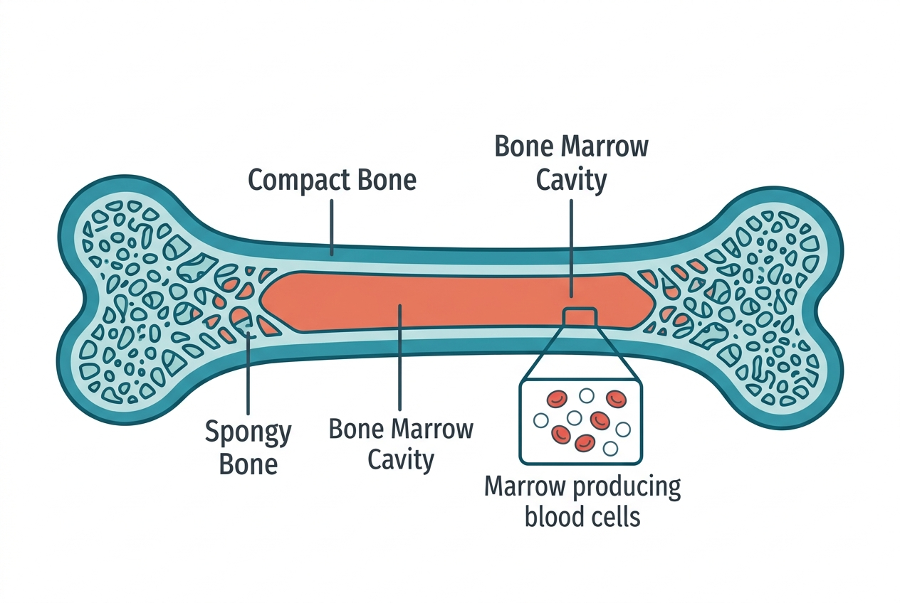

The musculoskeletal system does far more than let you walk and lift things. Bones store minerals, produce blood cells, and protect vital organs. Muscles generate heat, regulate blood sugar by storing glucose, and serve as the body's largest endocrine organ, releasing signaling molecules during physical activity. This system is metabolically active tissue, not passive scaffolding.

## The skeletal system

The adult human skeleton consists of 206 bones. These can be classified by shape — long bones (femur, humerus), short bones (wrist bones), flat bones (skull, ribs), and irregular bones (vertebrae). Bones serve several functions:

- **Structural support:** The skeleton provides the framework that holds the body upright and gives it shape.
- **Protection:** The skull protects the brain, the rib cage shields the heart and lungs, and the vertebral column guards the spinal cord.
- **Movement:** Bones serve as levers. Muscles attach to bones via tendons and pull on them to produce movement at joints.
- **Mineral storage:** Bones are the body's primary reservoir of calcium and phosphorus. When blood calcium drops, parathyroid hormone signals bones to release calcium. When calcium is abundant, calcitonin from the thyroid promotes calcium deposition into bone.
- **Blood cell production:** Red bone marrow, found in the interior of certain bones (pelvis, vertebrae, sternum, femur heads), produces red blood cells, white blood cells, and platelets through a process called hematopoiesis.

### Bone remodeling

Bone is not static — it is constantly being broken down and rebuilt. Specialized cells called osteoclasts break down old bone tissue, while osteoblasts build new bone. In a healthy adult, the entire skeleton is remodeled roughly every 10 years.

This remodeling process responds to mechanical stress. Bones that bear more load become denser and stronger (Wolff's law). This is why weight-bearing exercise is important for bone health — especially for preventing age-related bone loss (osteoporosis).

## The muscular system

The body has three types of muscle tissue:

- **Skeletal muscle:** Voluntary, striated muscle attached to bones. It makes up about 40% of total body weight and is responsible for movement, posture, and heat production. The human body has over 600 skeletal muscles.
- **Cardiac muscle:** Found only in the heart. It is striated like skeletal muscle but contracts involuntarily and continuously throughout life.
- **Smooth muscle:** Found in the walls of blood vessels, the digestive tract, the bladder, and the airways. It contracts involuntarily and is controlled by the autonomic nervous system.

### How muscles contract

Skeletal muscle fibers contain protein filaments — actin (thin) and myosin (thick). When a motor neuron sends a signal to a muscle fiber, calcium ions are released within the cell, allowing myosin heads to bind to actin and pull the filaments past each other. This sliding-filament mechanism shortens the muscle fiber, producing contraction.

Muscle contraction requires ATP (adenosine triphosphate) — the cell's energy currency. For short, intense bursts, muscles use stored ATP and creatine phosphate. For sustained activity, they rely on glucose (from blood or stored glycogen) and fatty acids, metabolized through aerobic pathways.

### Muscles as metabolic tissue

Skeletal muscles are the body's largest site of glucose uptake. After a meal, insulin signals muscles to absorb glucose from the blood and store it as glycogen. During exercise, muscles can take up glucose even without insulin, which is one reason physical activity improves blood sugar regulation.

Muscles also release signaling molecules called myokines during contraction. These molecules have wide-ranging effects: they promote fat breakdown, reduce inflammation, improve insulin sensitivity, and may even support brain health. The discovery of myokines is why researchers increasingly describe skeletal muscle as an endocrine organ.

## Joints

Where two or more bones meet, a joint provides controlled movement. The most mobile joints — synovial joints like the knee, hip, and shoulder — are enclosed in a joint capsule and lubricated by synovial fluid. Articular cartilage covers the bone surfaces within the joint, reducing friction.

Ligaments connect bone to bone and stabilize joints. Tendons connect muscle to bone and transmit the force of muscular contraction.

## Connections to other systems

- The **nervous system** controls voluntary muscle movement and the reflexes that protect joints and maintain posture.
- The **cardiovascular system** delivers oxygen and nutrients to muscles and bones and removes metabolic waste during activity.
- The **endocrine system** regulates bone density (parathyroid hormone, calcitonin, vitamin D, estrogen, testosterone) and muscle metabolism (insulin, growth hormone, testosterone, cortisol).
- The **respiratory system** provides the oxygen that muscles need for aerobic energy production.
- The **immune system** is supplied with new white blood cells produced in the bone marrow.

## Sources

- [NIAMS – Bones, Muscles, and Joints](https://www.niams.nih.gov/)
- [OpenStax Anatomy and Physiology – The Musculoskeletal System](https://openstax.org/books/anatomy-and-physiology-2e/pages/6-1-the-functions-of-the-skeletal-system)
- [MedlinePlus – Bones, Joints, and Muscles](https://medlineplus.gov/bonesjointsandmuscles.html)
- [Cleveland Clinic – Musculoskeletal System](https://my.clevelandclinic.org/health/body/21199-musculoskeletal-system)
