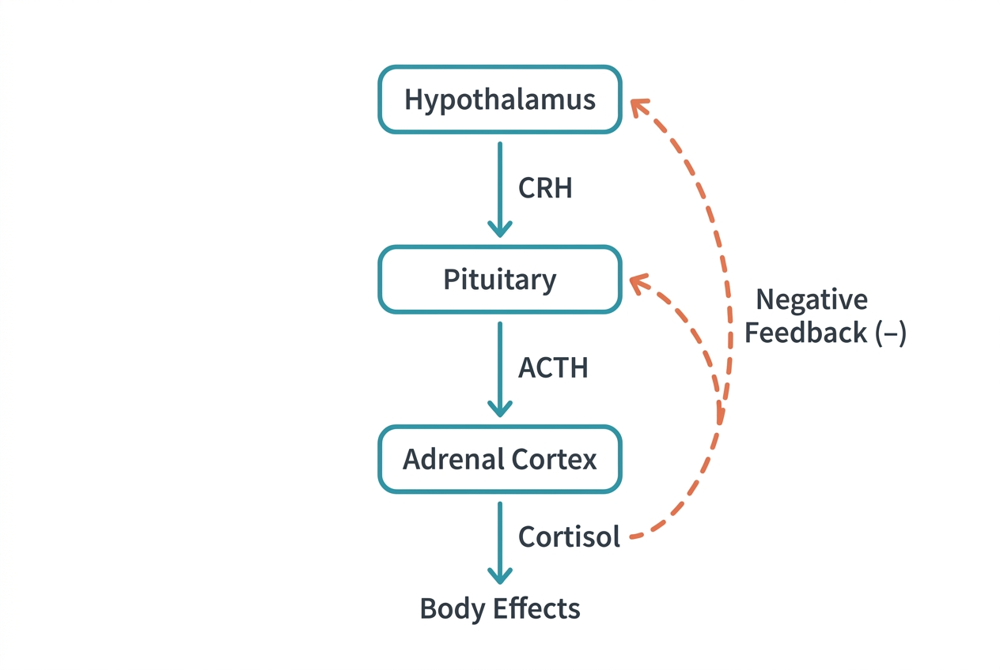
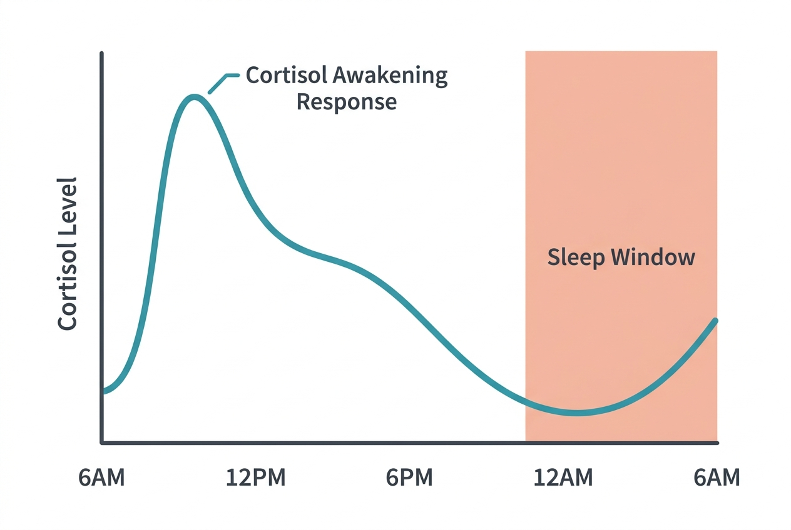

Cortisol is often simplified as "the stress hormone," but that label sells it short. Cortisol is essential for life. It regulates blood sugar, influences blood pressure, modulates the immune system, and helps the body metabolize fat, protein, and carbohydrates. The problem is not cortisol itself — it is what happens when cortisol stays elevated for weeks or months at a time.

## Where cortisol comes from

Cortisol is a steroid hormone produced by the adrenal cortex — the outer layer of the adrenal glands, which sit on top of each kidney. Its production is controlled by the hypothalamic-pituitary-adrenal (HPA) axis:

1. The **hypothalamus** releases corticotropin-releasing hormone (CRH).
2. CRH signals the **anterior pituitary** to release adrenocorticotropic hormone (ACTH).
3. ACTH travels through the bloodstream to the **adrenal cortex**, which responds by producing and releasing cortisol.
4. When cortisol levels rise sufficiently, they signal the hypothalamus and pituitary to reduce CRH and ACTH output — a classic negative feedback loop.

## The daily cortisol rhythm

Cortisol follows a predictable daily pattern called the diurnal rhythm. Levels are highest in the early morning, typically peaking around 30 minutes after waking (the cortisol awakening response). They then gradually decline throughout the day, reaching their lowest levels around midnight.

This rhythm is not random — it is coordinated by the body's master circadian clock in the hypothalamus (the suprachiasmatic nucleus). Morning cortisol helps mobilize glucose, raise blood pressure, and promote alertness. The evening drop in cortisol allows melatonin to rise and facilitates sleep onset.

## The acute stress response

When the brain perceives a threat — physical danger, a sudden loud noise, an argument, a looming deadline — the HPA axis activates rapidly:

- Cortisol rises within minutes.
- It mobilizes glucose from liver glycogen stores and promotes gluconeogenesis, ensuring the brain and muscles have fuel.
- It suppresses non-urgent functions: digestion slows, reproductive hormone release is reduced, and non-critical immune processes are dampened.
- It works alongside adrenaline (epinephrine), which is released from the adrenal medulla for an even faster response — accelerating heart rate, dilating airways, and sharpening focus.

This is an appropriate, life-preserving response. When the threat passes, cortisol levels return to baseline, and normal functions resume. The system is designed for brief activations followed by recovery.

## When cortisol stays high

The stress response becomes problematic when it does not turn off. Chronic psychological stress — ongoing work pressure, financial strain, relationship conflict, sleep deprivation, or persistent anxiety — can keep the HPA axis partially activated for extended periods.

The consequences of chronically elevated cortisol affect multiple systems:

### Metabolic effects
- Sustained cortisol promotes gluconeogenesis and insulin resistance, raising blood sugar levels. Over time, this increases the risk of type 2 diabetes.
- Cortisol preferentially promotes fat storage in the abdominal area (visceral fat), which is metabolically more harmful than subcutaneous fat.
- It increases appetite, particularly for calorie-dense foods high in sugar and fat.

### Immune effects
- Short-term cortisol elevation can enhance certain immune responses. But chronic elevation suppresses the immune system, reducing the body's ability to fight infections and potentially slowing wound healing.
- Paradoxically, chronic stress can also increase systemic inflammation. When the immune system becomes resistant to cortisol's anti-inflammatory signal (similar to insulin resistance), inflammatory processes go unchecked.

### Cardiovascular effects
- Elevated cortisol raises blood pressure and can contribute to endothelial dysfunction (damage to blood vessel lining), increasing cardiovascular risk over time.

### Brain and cognitive effects
- Chronic cortisol exposure can shrink the hippocampus — the brain region involved in memory formation — and impair memory and learning.
- It can increase amygdala reactivity, making you more sensitive to perceived threats and maintaining the cycle of stress.

### Sleep effects
- Elevated evening cortisol disrupts the natural cortisol-melatonin relationship, making it harder to fall asleep and reducing sleep quality. Poor sleep, in turn, elevates cortisol the next day, creating a self-reinforcing cycle.

## Cortisol is not the enemy

It is worth emphasizing that cortisol itself is not harmful. You need it to wake up in the morning, regulate blood pressure, respond to acute challenges, and maintain normal blood sugar. The issue is the duration and context of elevation.

Brief, well-bounded cortisol spikes — from exercise, a cold shower, or a short-term challenge — are normal and even beneficial. It is the sustained, unresolved elevation that causes damage, and we will revisit this distinction in the lifestyle section when we discuss chronic stress management.

## Sources

- [Mayo Clinic – Chronic Stress Puts Your Health at Risk](https://www.mayoclinic.org/healthy-lifestyle/stress-management/in-depth/stress/art-20046037)
- [NIH – Understanding the Stress Response](https://www.health.harvard.edu/staying-healthy/understanding-the-stress-response)
- [OpenStax Anatomy and Physiology – The Adrenal Glands](https://openstax.org/books/anatomy-and-physiology-2e/pages/17-6-the-adrenal-glands)
- [Cleveland Clinic – Cortisol](https://my.clevelandclinic.org/health/articles/22187-cortisol)
