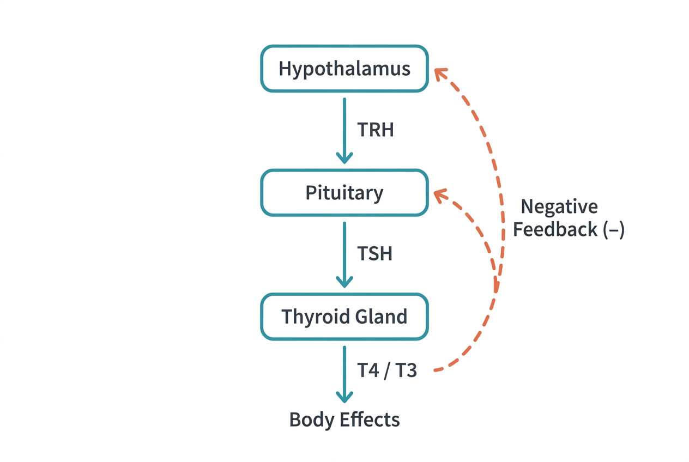

If cortisol is a system-wide priority interrupt, thyroid hormones are more like the CPU clock speed. They set the baseline metabolic rate for nearly every cell — determining how fast you burn calories, how warm your body stays, how quickly your heart beats at rest, and even how fast you think. When thyroid levels are off, the effects are pervasive and often subtle.

## The thyroid gland

The thyroid is a butterfly-shaped gland in the front of the neck, just below the Adam's apple. It weighs only about 20 to 30 grams but has enormous influence because its hormones affect virtually every organ system.

The thyroid produces two main hormones:

- **Thyroxine (T4):** The more abundant hormone. It has four iodine atoms and is relatively inactive. T4 acts mainly as a precursor — a reservoir that circulates in the blood.
- **Triiodothyronine (T3):** The active form. It has three iodine atoms and is roughly three to five times more potent than T4. Most T3 is produced not by the thyroid itself but by conversion from T4 in peripheral tissues, particularly the liver and kidneys.

About 99% of thyroid hormones in the blood are bound to carrier proteins. Only the unbound (free) fraction is biologically active. This is why lab tests often measure free T4 and free T3 specifically.

## The HPT axis

Thyroid hormone production is regulated by the hypothalamic-pituitary-thyroid axis:

1. The **hypothalamus** releases thyrotropin-releasing hormone (TRH).
2. TRH signals the **anterior pituitary** to release thyroid-stimulating hormone (TSH).
3. TSH stimulates the **thyroid gland** to produce and release T4 and T3.
4. When T4 and T3 levels rise, they feed back to the hypothalamus and pituitary to suppress TRH and TSH release — a negative feedback loop.

TSH levels are often the first test ordered to evaluate thyroid function. High TSH typically means the thyroid is underperforming (hypothyroidism) — the pituitary is shouting louder because it is not getting enough T4/T3 back. Low TSH suggests the thyroid is overactive (hyperthyroidism) — the pituitary has backed off because hormone levels are already too high.

## What thyroid hormones do

Thyroid hormones influence cellular metabolism through a remarkably broad set of actions:

- **Basal metabolic rate:** T3 increases oxygen consumption and heat production in most tissues. This is why thyroid dysfunction affects body weight and temperature regulation.
- **Cardiovascular function:** T3 increases heart rate and the strength of cardiac contraction. Hyperthyroidism can cause a rapid heart rate (tachycardia) and palpitations; hypothyroidism can slow the heart.
- **Nervous system:** Thyroid hormones are essential for normal brain development in infants and children. In adults, they influence alertness, mood, and reflexes. Hypothyroidism often causes brain fog, depression, and slowed reflexes.
- **Digestive system:** Thyroid hormones affect gut motility. Hyperthyroidism can cause diarrhea; hypothyroidism can cause constipation.
- **Bone and muscle:** T3 influences bone turnover and muscle protein metabolism. Excess thyroid hormone accelerates bone loss.
- **Cholesterol metabolism:** Hypothyroidism is associated with elevated LDL cholesterol because thyroid hormones normally help the liver clear LDL from the blood.

## Iodine: a critical nutrient

The thyroid cannot make its hormones without iodine. The body does not produce iodine, so it must come from the diet — primarily from iodized salt, seafood, dairy products, and seaweed. The recommended daily intake for adults is 150 micrograms.

Iodine deficiency was historically a leading cause of hypothyroidism and goiter (thyroid enlargement). The introduction of iodized salt in the 1920s largely eliminated this problem in many countries, though it remains an issue in some parts of the world.

## Hypothyroidism and hyperthyroidism

### Hypothyroidism (underactive thyroid)

The most common cause in countries with adequate iodine is Hashimoto's thyroiditis, an autoimmune condition in which the immune system gradually destroys thyroid tissue. Symptoms develop slowly and include:

- Fatigue and sluggishness
- Weight gain
- Cold intolerance
- Dry skin and hair
- Constipation
- Depression
- Elevated cholesterol

Hypothyroidism is more common in women and its prevalence increases with age. According to the American Thyroid Association, an estimated 20 million Americans have some form of thyroid disease, and up to 60% are unaware of their condition.

### Hyperthyroidism (overactive thyroid)

The most common cause is Graves' disease, another autoimmune condition in which antibodies stimulate the thyroid to overproduce hormones. Symptoms include:

- Rapid heart rate and palpitations
- Unintentional weight loss
- Heat intolerance and excessive sweating
- Anxiety and irritability
- Tremor
- Frequent bowel movements

Both conditions are diagnosable with blood tests (TSH, free T4, free T3) and treatable, but they illustrate how a single hormonal imbalance can affect the entire body.

## Sources

- [American Thyroid Association – Thyroid Function Tests](https://www.thyroid.org/thyroid-function-tests/)
- [NIDDK – Hypothyroidism](https://www.niddk.nih.gov/health-information/endocrine-diseases/hypothyroidism)
- [NIDDK – Hyperthyroidism](https://www.niddk.nih.gov/health-information/endocrine-diseases/hyperthyroidism)
- [NIH ODS – Iodine Fact Sheet](https://ods.od.nih.gov/factsheets/Iodine-HealthProfessional/)
- [OpenStax Anatomy and Physiology – The Thyroid Gland](https://openstax.org/books/anatomy-and-physiology-2e/pages/17-4-the-thyroid-gland)
