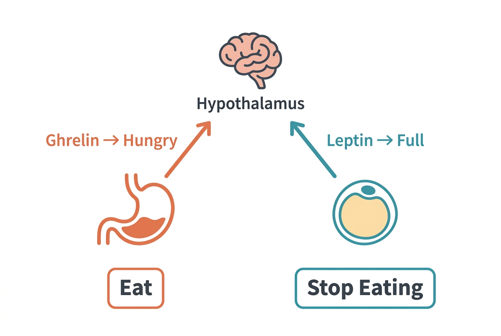

Hunger is not just a feeling — it is a hormonal signal. Two hormones in particular act as the primary regulators of appetite: ghrelin, which tells your brain you are hungry, and leptin, which tells your brain you have enough energy stored. Together, they form a feedback system designed to keep your body weight relatively stable over time. But this system did not evolve for a world of constant food availability.

## Ghrelin: the hunger signal

Ghrelin is a peptide hormone produced primarily by specialized cells in the stomach lining. It is often called the "hunger hormone" because its levels rise before meals and fall after eating.

### How ghrelin works

When your stomach is empty, ghrelin secretion increases. Ghrelin travels through the bloodstream to the hypothalamus — specifically the arcuate nucleus — where it activates neurons that stimulate appetite and food-seeking behavior.

Ghrelin levels follow a predictable pattern aligned with your usual meal times. If you typically eat lunch at noon, ghrelin begins rising before noon. This pattern is partly learned — if you shift your meal schedule, ghrelin timing will gradually adjust.

Beyond appetite, ghrelin has several other effects:

- **Growth hormone release:** Ghrelin stimulates the pituitary gland to release growth hormone, which promotes tissue repair and fat metabolism.
- **Gastric motility:** It increases stomach contractions, preparing the digestive system for incoming food.
- **Reward and motivation:** Ghrelin acts on brain regions involved in reward processing, making food more appealing and motivating food-seeking behavior.

### What raises ghrelin

- Fasting and calorie restriction
- Sleep deprivation (even a single night of poor sleep can elevate ghrelin levels the next day)
- Weight loss (the body increases ghrelin as part of its defense against weight reduction)

### What lowers ghrelin

- Eating a meal (particularly one with protein, which suppresses ghrelin more effectively than carbohydrates or fat)
- Adequate sleep

## Leptin: the satiety signal

Leptin is a protein hormone produced by fat cells (adipocytes). The amount of leptin circulating in the blood is roughly proportional to the amount of body fat — more fat tissue produces more leptin.

### How leptin works

Leptin signals the hypothalamus that the body has adequate energy reserves. In response, the hypothalamus reduces appetite, increases energy expenditure, and maintains normal functioning of other hormonal systems (thyroid, reproductive, immune).

In theory, this should create a self-correcting system: gain fat → leptin rises → appetite decreases → energy expenditure increases → fat stores normalize.

### Leptin resistance

In practice, many individuals with obesity have very high leptin levels — their fat cells are sending a strong satiety signal — but the brain does not respond appropriately. This is called leptin resistance.

The mechanisms are not fully understood but appear to involve:

- Reduced transport of leptin across the blood-brain barrier
- Impaired intracellular signaling in hypothalamic neurons
- Chronic low-grade inflammation, which can interfere with leptin receptor function

Leptin resistance creates a paradox: the body has ample energy stored as fat, but the brain behaves as if it is starving — maintaining a high appetite and reducing energy expenditure. This is one reason why sustained weight loss is physiologically difficult. The concept is analogous to insulin resistance — the signal is present but the response is blunted.

> **What's still debated:** The exact mechanisms of leptin resistance are an active area of research. Some researchers propose that leptin resistance is a cause of weight gain; others argue it is more a consequence. The clinical significance of trying to directly manipulate leptin levels remains unclear, and leptin-based therapies have not proven effective for typical obesity.

## The interplay: ghrelin, leptin, and weight loss

When a person loses weight through calorie restriction:

- Ghrelin levels increase (the stomach sends a stronger hunger signal).
- Leptin levels decrease (less fat tissue means less leptin production).
- The hypothalamus interprets this as an energy deficit and responds by increasing hunger, reducing metabolic rate, and increasing the drive to eat.

This dual hormonal shift is why weight loss often becomes harder over time and why weight regain is common. The body is not trying to be difficult — it is running a survival program that was shaped by millions of years of food scarcity.

## Sleep and appetite hormones

Sleep deprivation disrupts this system significantly. Research has consistently shown that insufficient sleep (typically defined as less than 6 to 7 hours) is associated with:

- Higher ghrelin levels
- Lower leptin levels
- Increased appetite, especially for high-calorie, carbohydrate-rich foods

This hormonal disruption is one mechanism linking poor sleep to weight gain and metabolic dysfunction — a topic we will revisit in the sleep section.

## Sources

- [Cleveland Clinic – Ghrelin](https://my.clevelandclinic.org/health/body/22804-ghrelin)
- [Cleveland Clinic – Leptin](https://my.clevelandclinic.org/health/articles/22446-leptin)
- [NIH – Short Sleep Duration Is Associated with Reduced Leptin, Elevated Ghrelin, and Increased Body Mass Index (PMC)](https://pmc.ncbi.nlm.nih.gov/articles/PMC535701/)
- [MedlinePlus – Appetite](https://medlineplus.gov/ency/article/003121.htm)
